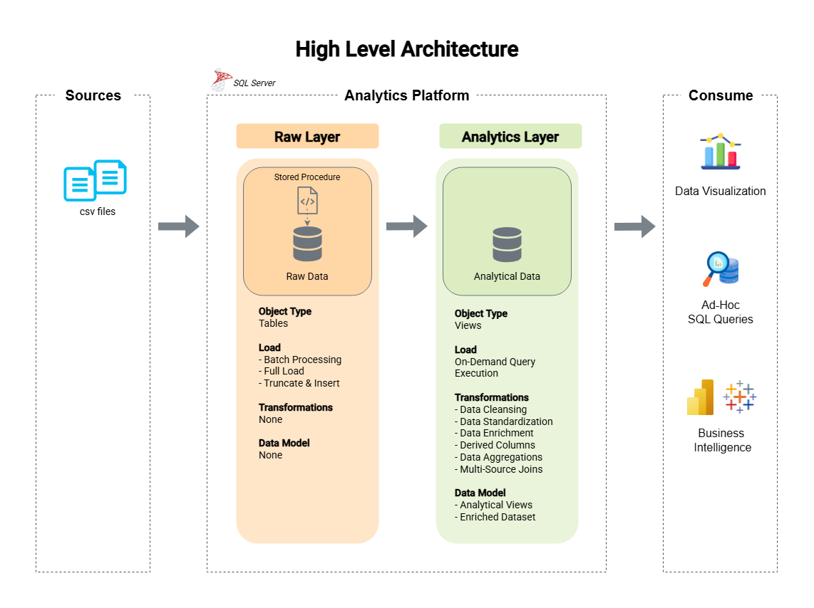

# CO₂ Emissions SQL Analysis Project

A SQL Server analytics project focused on processing, transforming, and analyzing global CO₂ emissions data.

The project demonstrates how to build a lightweight analytical platform using raw CSV datasets, SQL-based transformations, and analytical views optimized for reporting and visualization.

The project includes:

- raw data ingestion from CSV files
- data cleansing and standardization
- multi-source data enrichment
- analytical SQL views
- data quality validation
- emissions analysis and aggregations
- visualization-ready datasets

---

## 🏗️ High Level Architecture

This project implements a layered SQL analytics platform designed to process and analyze global CO₂ emissions data from multiple source datasets.

The architecture follows a simplified layered approach consisting of a Raw Layer and an Analytics Layer.



---

## Layers of the Analytics Platform

### Raw Layer

- Stores source CSV datasets in their original form
- Uses SQL Server tables for raw data ingestion
- Loads data using BULK INSERT and stored procedures
- Applies no transformations during loading
- Serves as the staging area for analytical processing

### Analytics Layer

- Standardizes country and continent mappings
- Cleans and enriches emissions datasets
- Combines emissions, population, and land-use data
- Creates analytical SQL views for reporting and visualization
- Produces enriched datasets optimized for analysis

---

## 📚 Additional Documentation

Additional project documentation is available in the `/docs` folder:

- [Architecture & Data Design](docs/architecture.md) – describes the data flow and data catalog.

---

## 🔎 Analytical SQL

The analytical part of the project is based on SQL queries created to explore CO₂ emissions trends, compare emissions across continents, and prepare aggregated datasets for visualization.

The final insights and visual outputs are documented in a separate file. This includes key findings from the SQL analysis as well as charts created in Flourish.

- [Analytical Insights & Visualizations](docs/insights.md)

---

## 🧠 Skills Demonstrated

This project demonstrates practical SQL and data analysis skills, including:

- designing a lightweight SQL analytics platform
- creating raw and analytics database layers
- importing CSV data into SQL Server using `BULK INSERT`
- building stored procedures for repeatable data loading
- creating analytical views
- standardizing reference data
- joining multiple datasets into an enriched analytical model
- creating derived columns for analysis
- preparing datasets for reporting and visualization
- documenting data architecture and analytical outputs

---

## 📁 Repository Structure

```text
co2-emissions-sql-analysis/
│
├── datasets/                                      # Raw CSV source files used as input data
│   ├── annual_co2_emissions.csv                   # Annual CO₂ emissions by country and year
│   ├── country_codes.csv                          # Country, ISO code, and continent reference data
│   ├── land_use_change.csv                        # CO₂ emissions related to land-use change
│   └── population.csv                             # Annual population data by country and year
│
├── docs/                                          # Project documentation
│   ├── diagrams/                                  # Architecture and data flow diagrams
│   │   ├── high_level_architecture.drawio.png     # Overview of the analytics platform architecture
│   │   └── data_flow.drawio.png                   # Data movement from CSV files to analytical views
│   │
│   ├── architecture.md                            # Data flow description, layer design, and data catalog
│   └── insights.md                                # Analytical findings and Flourish visualizations
│
├── scripts/                                       # SQL scripts used to build and run the project
│   ├── raw_layer/                                 # Scripts for database setup, raw tables, and data loading
│   │   ├── init_database.sql                      # Creates the database and required schemas
│   │   ├── ddl_raw_layer.sql                      # Creates raw layer tables
│   │   └── proc_load_raw_layer.sql                # Loads CSV files into raw tables using BULK INSERT
│   │
│   └── analytics_layer/                           # SQL views used for analytical transformations
│       ├── country_codes_standardized.sql         # Standardizes country and continent mappings
│       └── co2_emissions_enriched.sql             # Combines emissions, population, and land-use data
│
├── visuals/                                       # Exported chart images used in documentation
│   ├── co2_emissions_continents.png               # Total CO₂ emissions by continent over time
│   ├── co2_emissions_per_capita_continents.png    # CO₂ emissions per capita by continent
│   └── co2_emissions_share_continents.png         # Share of global CO₂ emissions by continent
│
└── README.md                                      # Main project overview and navigation
```

---

## 🧩 Design Decisions & Simplifications

This project was intentionally designed as a lightweight analytics platform rather than a full enterprise data warehouse.

Key design decisions include:

- The project uses two layers only: `raw` and `analytics`.
- No separate modeled layer was created because the transformation logic is limited and handled directly in analytical views.
- No Star Schema was implemented because the project focuses on analytical enrichment and trend analysis rather than transactional business reporting.
- Raw tables preserve the original structure of the CSV datasets.
- Analytical views are used to standardize, enrich, and prepare the data for reporting and visualization.
- The project prioritizes clarity, reproducibility, and portfolio readability over unnecessary architectural complexity.

This simplified structure keeps the project focused while still demonstrating core SQL analytics, data modeling, and documentation skills.

---

## 🙏 Credits & Data Sources

This project uses publicly available datasets and external visualization resources.

### Data Sources

- [Our World in Data](https://ourworldindata.org/) – CO₂ emissions, population, and land-use related datasets
- [IBAN Country Codes](https://www.iban.com/country-codes) – country codes and continent reference data

### Tools & Visual Resources

- [SQL Server](https://www.microsoft.com/en-us/sql-server) – database engine used for data storage and analysis
- [SQL Server Management Studio](https://learn.microsoft.com/en-us/ssms/sql-server-management-studio-ssms) – used for SQL development and database management
- [Draw.io](https://www.drawio.com/) – used to create architecture and data flow diagrams
- [Flourish](https://flourish.studio/) – used to create interactive data visualizations
- [Flaticon](https://www.flaticon.com/) – icons used in diagrams and visual assets

### Note

This project was created for educational and portfolio purposes.  
All external datasets and visual assets belong to their respective owners.
